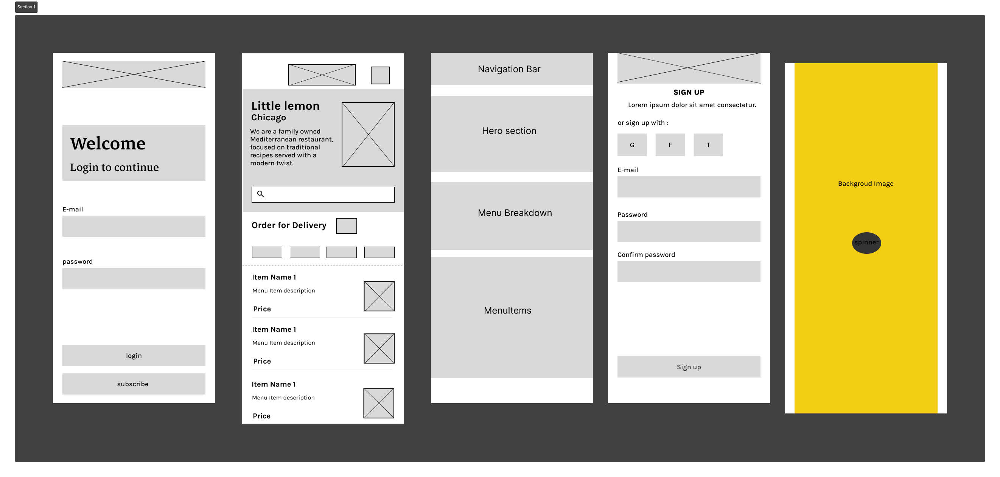

# Little Lemon - React Native Capstone Project

This project is a capstone to validate my React Native skills as part of the Meta React Native Specialization on Coursera. Little Lemon is a restaurant application developed using React Native.

## Project Overview

Little Lemon is a restaurant application that allows users to view the menu, register an account, add a profile picture, update their profile picture, and enable notifications.

## Features

- **View Menu**: Users can browse through the restaurant's menu items.
- **User Registration**: New users can create an account to access additional features.
- **Profile Picture Management**: Users can upload and update their profile picture.
- **Notification Settings**: Users can manage notification preferences within the app.

## Wireframe and High-Fidelity Designs

### Wireframe Design



This image showcases the initial wireframe design of the Little Lemon application, demonstrating the basic layout and structure.

### High-Fidelity Design


This image represents the high-fidelity design of the Little Lemon application, showing detailed UI/UX elements and styling.

## Getting Started

To run this project locally, follow these steps:

1. Clone the repository:

   ```bash
   git clone https://github.com/your_username/your_repository.git

## Technologies Used
- **React Native**
- **Expo**
- **JavaScript/TypeScript**
- **AsyncStorage (for preferences info)**
- **Redux/Toolkit**
- **Expo/SQLite (for storage)**
- **Expo/secure storage (for user authentication)**
  
## Contributing
Contributions are welcome! If you have suggestions or improvements for this project, please open an issue or create a pull request.

## License
This project is licensed under the MIT License - see the LICENSE file for details.